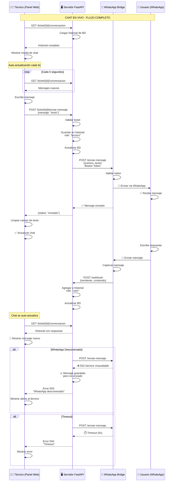
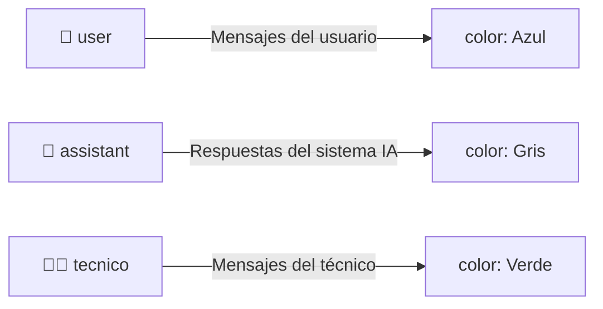
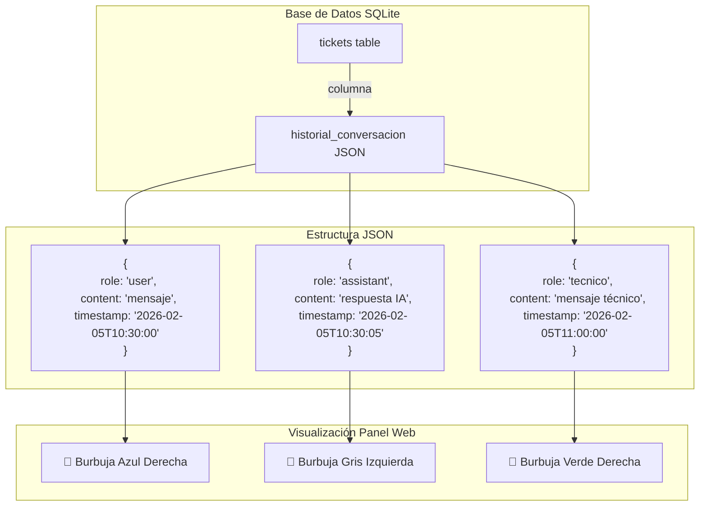
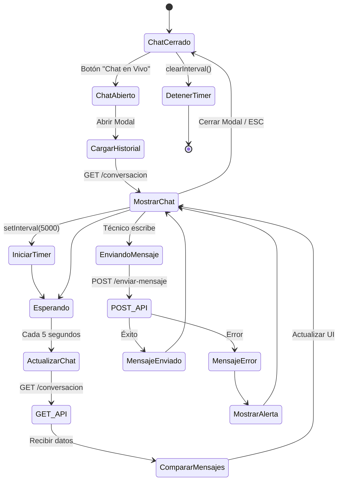

```mermaid
sequenceDiagram
    participant T as 👨‍💻 Técnico (Panel Web)
    participant S as 🖥️ Servidor FastAPI
    participant W as 📱 WhatsApp Bridge
    participant U as 👤 Usuario (WhatsApp)
    
    Note over T,U: CHAT EN VIVO - FLUJO COMPLETO
    
    %% Abrir Chat
    T->>S: GET /ticket/{id}/conversacion
    S->>S: Cargar historial de BD
    S-->>T: Historial completo
    T->>T: Mostrar modal de chat
    
    %% Auto-actualización
    Note over T: Auto-actualización cada 5s
    loop Cada 5 segundos
        T->>S: GET /ticket/{id}/conversacion
        S-->>T: Mensajes nuevos
    end
    
    %% Técnico envía mensaje
    T->>T: Escribe mensaje
    T->>S: POST /ticket/{id}/enviar-mensaje<br/>{mensaje: "texto"}
    
    S->>S: Validar ticket
    S->>S: Guardar en historial<br/>role: "tecnico"
    S->>S: Actualizar BD
    
    S->>W: POST /enviar-mensaje<br/>{numero, texto}<br/>Bearer Token
    W->>W: Validar token
    W->>U: 📨 Enviar via WhatsApp
    U->>U: 🔔 Recibe mensaje
    
    W-->>S: ✅ Mensaje enviado
    S-->>T: {status: "enviado"}
    T->>T: Limpiar campo de texto
    T->>T: ✅ Actualizar chat
    
    %% Usuario responde
    U->>U: Escribe respuesta
    U->>W: 💬 Enviar mensaje
    W->>W: Capturar mensaje
    W->>S: POST /webhook<br/>{remitente, contenido}
    S->>S: Agregar a historial<br/>role: "user"
    S->>S: Actualizar BD
    
    Note over T: Chat se auto-actualiza
    T->>S: GET /ticket/{id}/conversacion
    S-->>T: Historial con respuesta
    T->>T: 📨 Mostrar mensaje nuevo
    
    %% Manejo de errores
    alt WhatsApp Desconectado
        S->>W: POST /enviar-mensaje
        W-->>S: ❌ 503 Service Unavailable
        S->>S: ⚠️ Mensaje guardado<br/>pero no enviado
        S-->>T: Error 503:<br/>"WhatsApp desconectado"
        T->>T: Mostrar alerta al técnico
    end
    
    alt Timeout
        S->>W: POST /enviar-mensaje
        W-->>S: ⏱️ Timeout (5s)
        S-->>T: Error 504:<br/>"Timeout"
        T->>T: Mostrar error
    end
```

### Leyenda de Roles en el Historial

```mermaid
graph LR
    A[👤 user] -->|"Mensajes del usuario"| B[color: Azul]
    C[🤖 assistant] -->|"Respuestas del sistema IA"| D[color: Gris]
    E[👨‍💻 tecnico] -->|"Mensajes del técnico"| F[color: Verde]
```

### Arquitectura de Datos

```mermaid
graph TB
    subgraph "Base de Datos SQLite"
        T[tickets table]
        T -->|columna| H[historial_conversacion JSON]
    end
    
    subgraph "Estructura JSON"
        H --> M1["{\n  role: 'user',\n  content: 'mensaje',\n  timestamp: '2026-02-05T10:30:00'\n}"]
        H --> M2["{\n  role: 'assistant',\n  content: 'respuesta IA',\n  timestamp: '2026-02-05T10:30:05'\n}"]
        H --> M3["{\n  role: 'tecnico',\n  content: 'mensaje técnico',\n  timestamp: '2026-02-05T11:00:00'\n}"]
    end
    
    subgraph "Visualización Panel Web"
        M1 --> V1[💬 Burbuja Azul Derecha]
        M2 --> V2[💬 Burbuja Gris Izquierda]
        M3 --> V3[💬 Burbuja Verde Derecha]
    end
```

### Flujo de Auto-actualización

```mermaid
stateDiagram-v2
    [*] --> ChatCerrado
    ChatCerrado --> ChatAbierto: Botón "Chat en Vivo"
    ChatAbierto --> CargarHistorial: Abrir Modal
    CargarHistorial --> MostrarChat: GET /conversacion
    MostrarChat --> IniciarTimer: setInterval(5000)
    
    IniciarTimer --> Esperando
    Esperando --> ActualizarChat: Cada 5 segundos
    ActualizarChat --> GET_API: GET /conversacion
    GET_API --> CompararMensajes: Recibir datos
    CompararMensajes --> MostrarChat: Actualizar UI
    MostrarChat --> Esperando
    
    MostrarChat --> EnviandoMensaje: Técnico escribe
    EnviandoMensaje --> POST_API: POST /enviar-mensaje
    POST_API --> MensajeEnviado: Éxito
    POST_API --> MensajeError: Error
    MensajeEnviado --> MostrarChat
    MensajeError --> MostrarAlerta
    MostrarAlerta --> MostrarChat
    
    MostrarChat --> ChatCerrado: Cerrar Modal / ESC
    ChatCerrado --> DetenerTimer: clearInterval()
    DetenerTimer --> [*]
```
